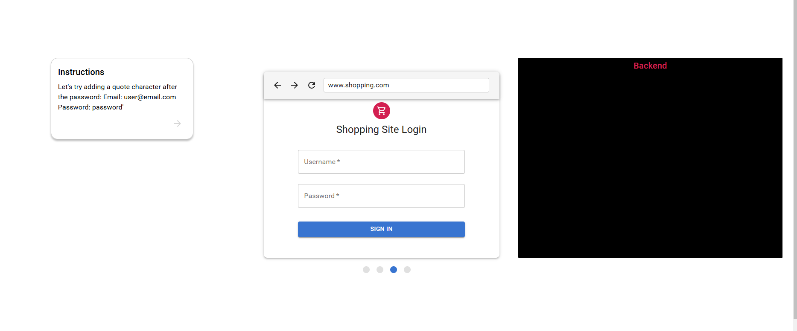
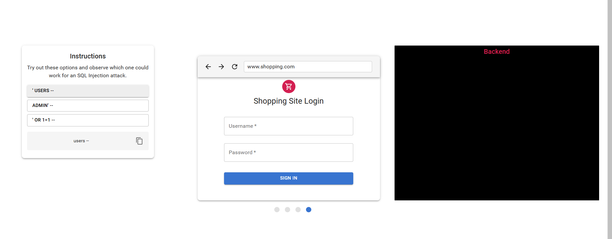
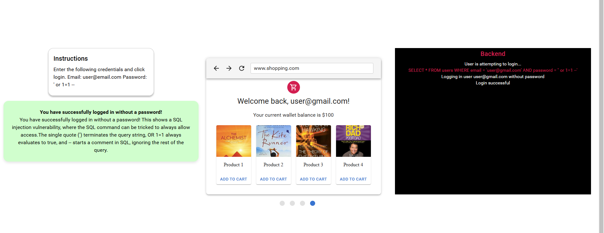

### Procedure

step 1.  Read the instruction and click the arrow  icon to move next instruction

 

 

 step 2. Read the instruction and  select each command  provided to the vulnurable site and observe the backend and the explanation

 

step 3. read the next instruction and and try to login attempt again with provided credentials

 

step 4. Read the instruction and attempt with the login credentials and observe the the access we got from the sql injection

 </div